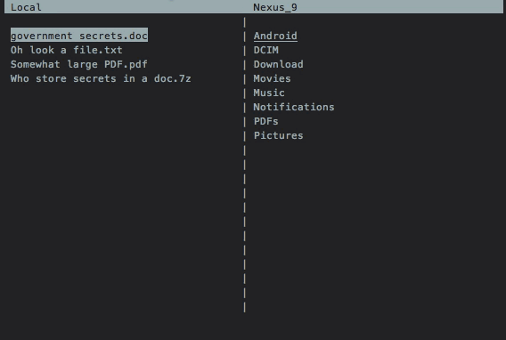

Marvin transfer
===============
A command line utility for easy file and folder transfer between local computer and android device  

  

Especially on mac transferring files to an android device can be a hassle. The Android File Transfer app is completely useless and setting up a mtp fuse can be unstable. That's why Marvin transfer exist, to ease the pain.  

## Install
### Requirements
* So far only **Python 3.3 or higher** is supported but the idea is to expand this support to Python 2.7  
* This utility uses the **ADB (Android Device Bridge)** as a backend and therefor it must be installed and adb must exist in the $PATH  

*(Tested on python3.3/3.5 on OSX 10.9 with Nexus 5/9 on Android Marshmallow)*

### Clone repository
Clone or download the repository

    git clone https://github.com/richrd/suplemon.git

Then you can **try it out** by simply 

    cd marvin-transfer
    ./marvin.py

**Install** it using python3

    cd marvin-transfer
    pip3 install .

After system wide install, start the application anywhere with

    marvin

### Uninstall
I you decide that you want to uninstall it *(if you installed it with pip3)*

    pip3 uninstall marvin-transfer

## Usage
The ui consist of two columns, the left one your local computers file system, the right you connected android device's system

* use **arrow keys** to navigate (right/left to enter/exit folders)
* **enter** to transfer currently selected file/foder
* **tab/space** to change focus between local computer and android device
* **escape/ctrl-c** to exit program
* typing letters works as a filter on the current directory, for faster navigation

## TODO
This utility is quite new and there's a bunch left to be done. Feel free to contribute if you want (with *Pull Requests* targeting *master*). 

* [X] Add help instructions (-h, --help)
* [X] Detect when disconnected
* [ ] In list put folders on top (with some distinction)
* [X] Handle resize
* [ ] Add delete option (start with files only)
* [X] Add title bar
* [ ] Update file list regularly
* [X] Fast navigation with letters
* [ ] Add option for invisible files/folders
* [ ] Visually show cutoffs (of file names 
* [ ] Remove requirement for adb in $PATH
* [ ] Add permanent configuration for stuff like invisible files and adb path
* [ ] Add package to PyPi for even easier installation
* [ ] \(Support python 2.7\)
    * [ ] Bunch of unicode fixes
        * [ ] declare utf-8 in all files
        * [ ] curses get_wchr() not supported (non-ascii entry)
        * [ ] fix all bytestring.encode('utf-8')
    * [ ] in ui.py, ~line 36, ceil/float seems to return floats (?)

## License
Fredrik Johansson © 2016 ([fredrik-johansson.com](http://fredrik-johansson.com)).

This software is licensed under GNU GPL v3, see file LICENSE for more details.
Simply put it, if you decide to distribute this software, please make your source code and changes are public as well, as I have done here. Sharing is caring 😊  

## Change log
2016-11-06
>  Initial release